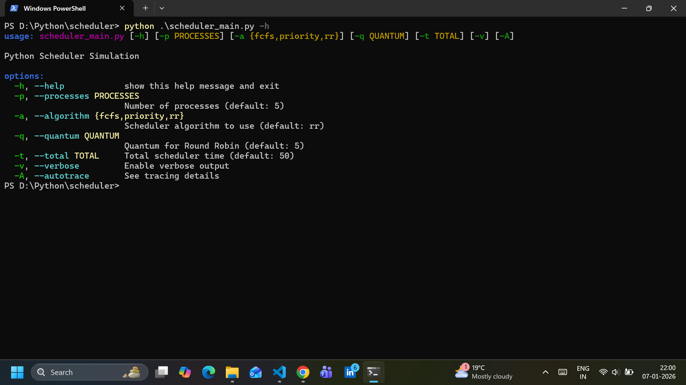
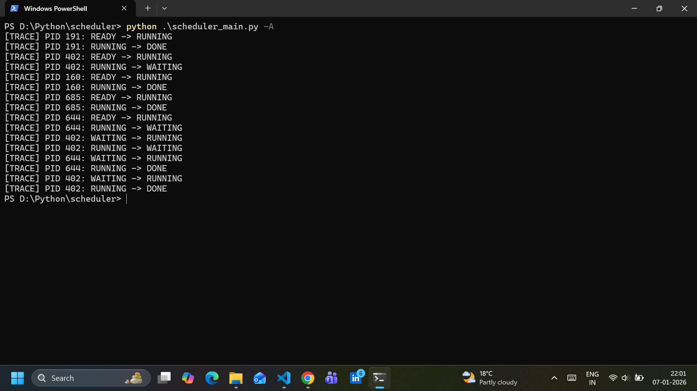
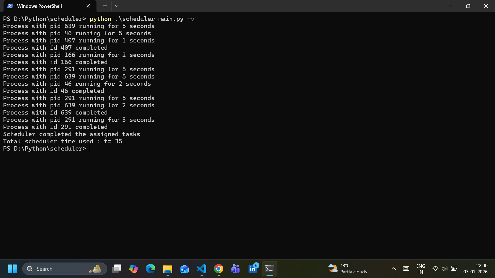

# Python Scheduler Simulator - v0.4

A simple Python project to simulate CPU scheduling algorithms, including:

- **First-Come-First-Serve (FCFS)**
- **Priority Scheduling**
- **Round Robin (RR)**
- **Shortest Job First(SJF)**

This project demonstrates process management and scheduling logic using Python classes and random process simulation.

---

## Features

- **FCFS:** Non-preemptive scheduling, processes executed in arrival order.
- **Priority Scheduling:** Random priorities assigned; processes sorted and executed by priority.
- **Round Robin:** Quantum-based preemptive scheduling; simulates execution with total scheduler time.
- **Shortest Job First:** Non Preemptive SJF with random burst times.
- **Verbose Mode:** Optional detailed output for each step of the scheduler.
- **Route:** Redirect state transition results into a user specified file
- **Autotrace Mode:** Optional tracing about the scheduler's states and processes
- **Unit Tests:** Ensure correctness of scheduler behavior.

---

## Installation

Clone this repository using git clone(ensure ```git``` is available on your machine first).Then,

```bash
git clone https://github.com/Kishore-M-r0502/CodeRepo.git
```
Alternatively, you may download the required Python source files directly from the python branch and run them locally without cloning the repository.
 
## Usage
## To run the currently available tests:
```bash
python -m unittest
```

To view help on the command line arguments, type ``` python scheduler_main.py -h```

Run FCFS:
```
python scheduler_main.py --algo fcfs -p 5
```

Run Priority Scheduling (verbose):
```
python scheduler_main.py --algorithm priority -p 8 -v
```

Run Round Robin:
```
python scheduler_main.py --algorithm rr -p 10 -q 5 -t 200 -v
```

Use Autotrace Mode:
```
python scheduler_main.py --algorithm rr -p 20 -q 10 -t 200 -v --autotrace 
```
# Examples

## Help text


## Autotrace Mode


## Verbose Mode


# Generated Documentation

- **PDF is generated from [File](docs/About_The_Simulator.md)**